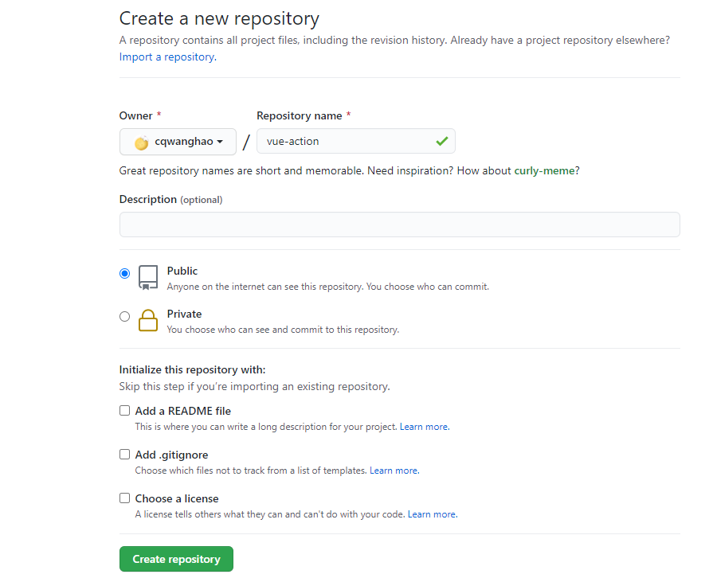
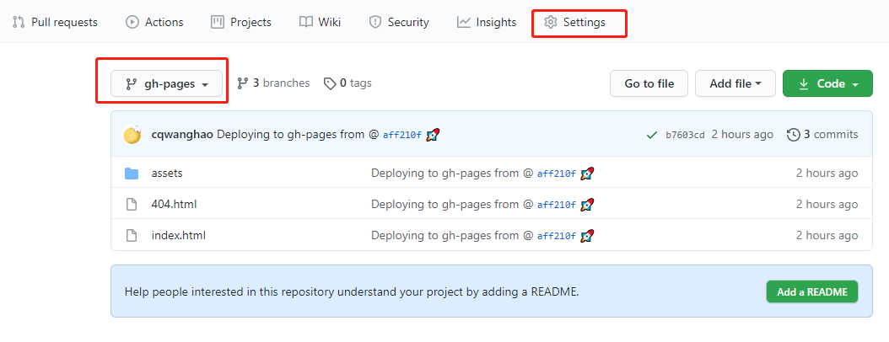
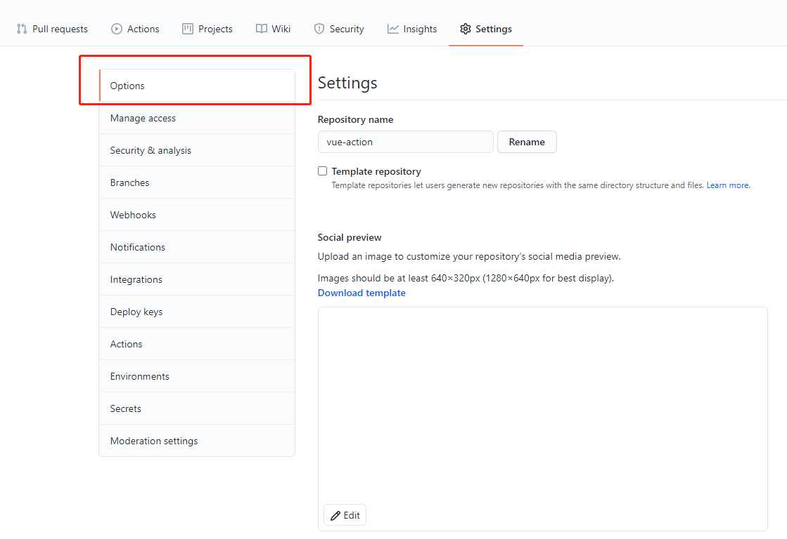
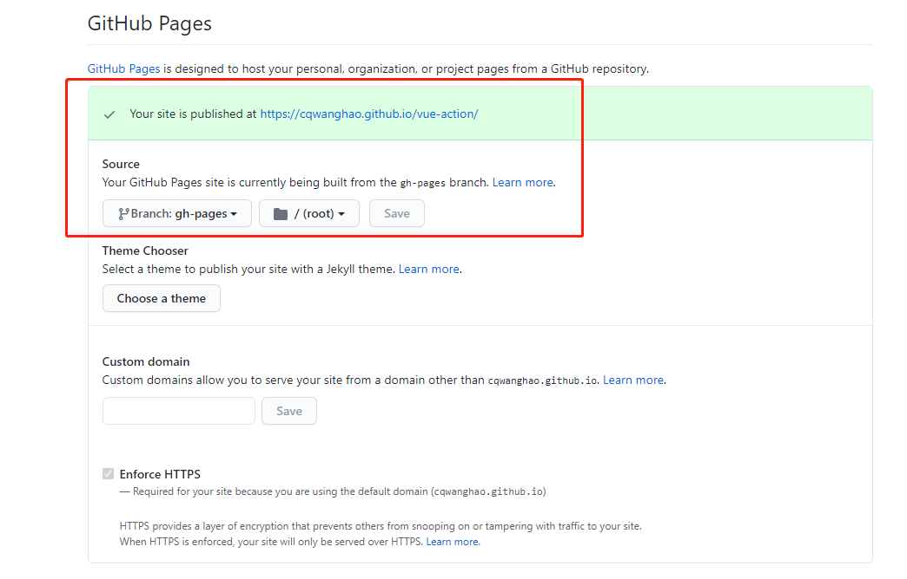
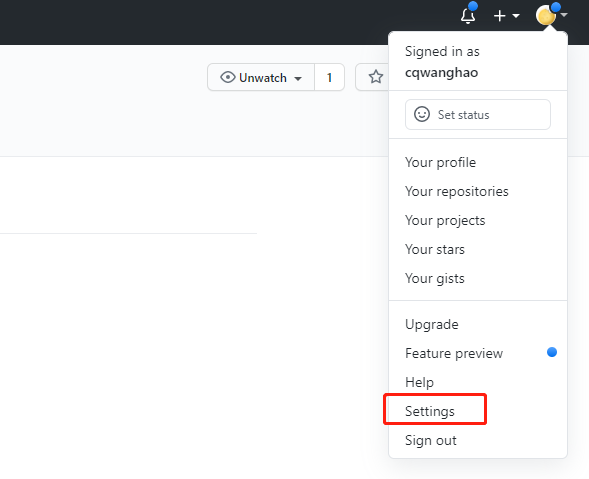
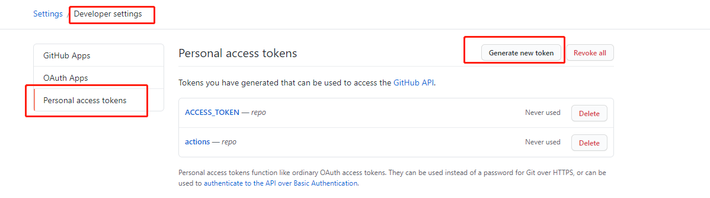
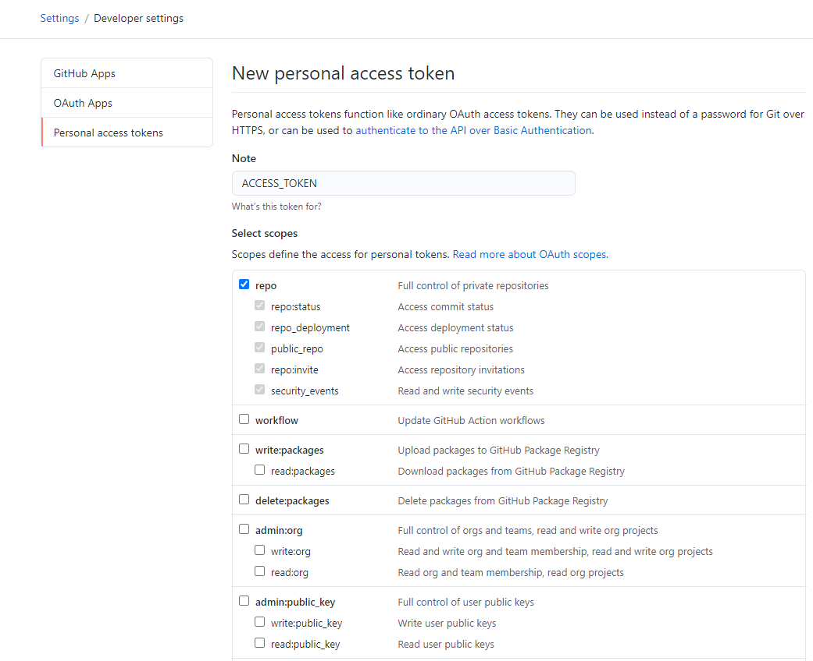
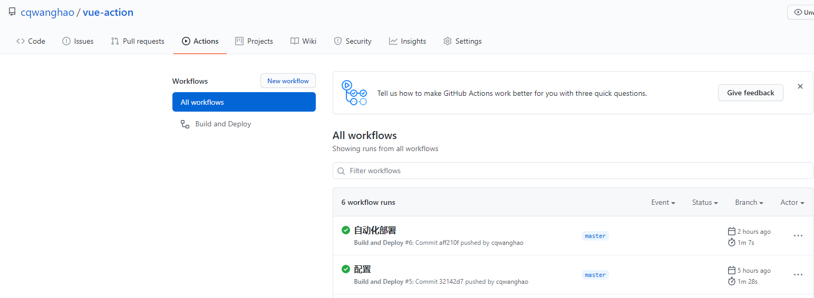
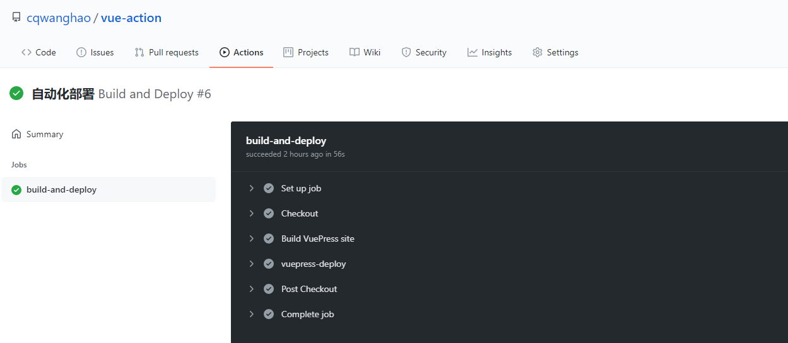

# 基于 vuepress 搭建博客教程 + 自动化部署 GitHub Actions

## 介绍

用官方的话来说`VuePress`是一款以`Vue`驱动的静态网站生成器,它的诞生初衷是为了支持`Vue`及其子项目的文档需求。由于vuepress支持自定义开发主题所以很多人拿它来写博客，下面我会用VuePress搭建一个极简的博客网站并使用[GitHub Actions](https://docs.github.com/en/actions)部署到[GitHub Pages](https://pages.github.com/)。

## 搭建博客


1. Vue初始化项目
```bash
vue create vue-action && cd vue-action
```

2. 将 VuePress 安装为本地依赖
```bash
yarn add -D vuepress # npm install -D vuepress
```

3. 创建文档
```bash
mkdir docs && echo '# Hello VuePress' > docs/README.md
```

4. 在 package.json 中添加一些 scripts
```json
{
  "scripts": {
    "docs:dev": "vuepress dev docs",
    "docs:build": "vuepress build docs"
  }
}
```

5. 在本地启动服务器
```bash
yarn docs:dev # npm run docs:dev
```
VuePress 会在 http://localhost:8080/vue-action/ 启动一个热重载的开发服务器。

## 部署
1. 在GitHub上创建一个仓库


2. 在 docs/.vuepress/config.js 中设置正确的 base
在 docs/.vuepress 文件夹下创建 config.js
```js
// config.js
module.exports = {
  dest: './docs/.vuepress/dist', // vuepress build 的输出目录
  base: '/vue-action/', // 部署站点的基础路径
  title: 'github actions文档自动化部署',  // 网站的标题，它将会被用作所有页面标题的前缀。
}
```

3. 配置.sh脚本
在项目根目录中，创建一个如下的`deploy.sh`文件
```bash
#!/usr/bin/env sh

# 确保脚本抛出遇到的错误
set -e

# 生成静态文件
npm run docs:build

# 进入生成的文件夹
cd docs/.vuepress/dist

# 如果是发布到自定义域名
# echo 'www.example.com' > CNAME

git init
git add .
git commit -m 'deploy'

# 如果发布到 https://<USERNAME>.github.io/vue-action
# git push -f https://github.com/<USERNAME>/vue-action.git master

# 如果发布到 https://<USERNAME>.github.io/<REPO>
git remote add origin https://github.com/cqwanghao/vue-action.git
git branch -M master
git push -f https://github.com/cqwanghao/vue-action.git master:gh-pages

cd -
```

4. 用sh脚本部署
打开`package.json`下新增一条命令
```json
"scripts": {
  "deploy": "bash deploy.sh"
}
```
打开控制台执行
```bash
npm run deploy
```

5. 设置仓库`GitHub Pages`访问路径
现在代码已经推送到远程仓库的gh-pages分支下,接下来我们需要设置博客的访问路径，点击右上角的Settings按钮进入设置。


选择目标分支为gh-pages,根目录为root


稍等几分钟后访问[https://cqwanghao.github.io/vue-action/](https://cqwanghao.github.io/vue-action/)此时发现我们的博客已经部署到Github Pages了。
到这里如果你只是希望你的博客可以随时在互联网被访问到，只需要在写完文章之后去执行 npm run deploy 这行命令就可以了。

## 使用 Github Actions 自动部署
现在我们写一篇文章并且发布到 GitHub Pags 需要手动执行sh脚本,使用GitHub Actions 可以帮助我们简化流程，让写完一篇文章后只需要将代码上传至 GitHub 就能帮我们自动构建部署到线上。

GitHub Actions 有一些自己的术语。
1.workflow （工作流程）：持续集成一次运行的过程，就是一个 workflow。

2.job （任务）：一个 workflow 由一个或多个 jobs 构成，含义是一次持续集成的运行，可以完成多个任务。

3.step（步骤）：每个 job 由多个 step 构成，一步步完成。

4.action （动作）：每个 step 可以依次执行一个或多个命令（action）。

想要了解更多Github Actions知识可以浏览官方[GitHub Actions快速入门](https://docs.github.com/cn/actions/quickstart),或者[阮一峰老师的GitHub Actions 入门教程](http://www.ruanyifeng.com/blog/2019/09/getting-started-with-github-actions.html)

## 创建个人访问令牌
1. 在任何页面的右上角，单击您的个人资料照片，然后单击 Settings（设置）


2. 在左侧边栏中，单击 Developer settings。


3. 在左侧边栏中，单击 Personal access tokens（个人访问令牌）=> Generate new token（生成新令牌）。


4. 给令牌一个描述性名称。
令牌名字一定要叫：`ACCESS_TOKEN`

5. 选择要授予此令牌的作用域或权限。 要使用令牌从命令行访问仓库，请选择 repo（仓库）。


6. 单击 Generate token（生成令牌）。

7. 单击复制将令牌复制到剪贴板。 出于安全原因，离开此页面后，您将无法再次看到令牌。

## 编写 workflow 文件
创建.github/workflows/vuepress-deploy.yml文件
```yml
name: docs

on:
  # 每当 push 到 master 分支时触发部署
  push:
    branches: [master]
  # 手动触发部署
  workflow_dispatch:

jobs:
  docs:
    runs-on: ubuntu-latest

    steps:
      - uses: actions/checkout@v2
        with:
          # “最近更新时间” 等 git 日志相关信息，需要拉取全部提交记录
          fetch-depth: 0

      - name: Setup Node.js
        uses: actions/setup-node@v1
        with:
          # 选择要使用的 node 版本
          node-version: "14"

      # 缓存 node_modules
      - name: Cache dependencies
        uses: actions/cache@v2
        id: yarn-cache
        with:
          path: |
            **/node_modules
          key: ${{ runner.os }}-yarn-${{ hashFiles('**/yarn.lock') }}
          restore-keys: |
            ${{ runner.os }}-yarn-

      # 如果缓存没有命中，安装依赖
      - name: Install dependencies
        if: steps.yarn-cache.outputs.cache-hit != 'true'
        run: yarn

      # 运行构建脚本
      - name: Build VuePress site
        run: yarn docs:build

      # 查看 workflow 的文档来获取更多信息
      # @see https://github.com/crazy-max/ghaction-github-pages
      - name: Deploy to GitHub Pages
        uses: JamesIves/github-pages-deploy-action@3.7.1
        with:
          ACCESS_TOKEN: ${{ secrets.ACCESS_TOKEN }}
          # 部署到 gh-pages 分支
          BRANCH: gh-pages
          # 部署目录为 VuePress 的默认输出目录
          FOLDER: docs/.vuepress/dist
```

```yml
name: Build and Deploy
on: [push]
jobs:
  build-and-deploy:
    runs-on: ubuntu-latest
    steps:
    - name: Checkout
      uses: actions/checkout@master

    # 运行构建脚本
    - name: Build VuePress site
      run: yarn && yarn docs:build

    - name: vuepress-deploy
      uses: JamesIves/github-pages-deploy-action@3.7.1
      with:
          ACCESS_TOKEN: ${{ secrets.ACCESS_TOKEN }}
          # 部署到 gh-pages 分支
          BRANCH: gh-pages
          # 部署目录为 VuePress 的默认输出目录
          FOLDER: docs/.vuepress/dist
    # env:
    #   ACCESS_TOKEN: ${{ secrets.ACCESS_TOKEN }}
    #   TARGET_REPO: cqwanghao/vue-action
    #   TARGET_BRANCH: gh_pages
    #   BUILD_SCRIPT: yarn && yarn docs:build
    #   BUILD_DIR: docs/.vuepress/dist/
```

以上代码主要配置内容如下:
1. branches 代表git push 触发flow的分支名称，如果你的分支不是master请修改正确。

2. run 表示运行命令，若没有修改的话就是 yarn docs:build。

3. ACCESS_TOKEN 读取GitHub仓库之前我们设置的 ACCESS_TOKEN，名称一定要与之前设置的相同。

4. BRANCH 部署到 gh-pages 分支下。

5. FOLDER 部署目录,如果没有修改默认配置就是 docs/.vuepress/dist。

完成以上配置，下次push代码的时候，就会自动开启构建。

尝试push代码，回到GitHub上点击actions,发现项目已经在自动构建了。


点击进入查看部署情况。


部署成功，如果构建失败GitHub会发送一封邮件到你的邮箱。

## 搭建遇到的问题
1. 如果你打算发布到 https://`<USERNAME>`.github.io/vue-action， 则需要配置 .vuepress/config.js base 属性,因为 base 默认是 "/",应该设置为"/vue-action/"。

2. 发布到线上后发现css样式丢失，经查看发现访问路径发生404的有可能是项目引用路径错误，本文没有修改过打包路径，用的是默认路径 docs/.vuepress/dist，如不一致请修改。

3. 本文所使用的actions版本是v3，以往教程中所讲到的使用的是JamesIves/github-pages-deploy-action v2版本，新版本语法已经发生了变化，如果继续使用就会发生错误。

4. ACCESS_TOKEN 一定要和github上的sectets上的名称相同。

